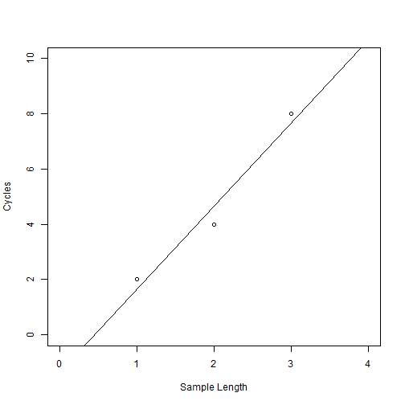

## Our New Wool Strength Estimator
Hello, fellow wool producers!
 
Tired of guessing your Cycles Until Failure every time you're thinking about a new Specimen Length? We were, too!!!  So we invented our newest product to make your wool-strength testing life easier, the <i><b>Wool Strength Estimator!!!</i></b>.
 
Take the guesswork out of deciding your Specimen Lengths!!!  With our handy tool, you plug in your numbers and the answers pop right out at you!!!  Our scientific tool does your work for you by using:
 
* recent experimental data (1964) and
* magical statistical techniques (least-squares regression) 
  
Just tell it what Specimen Length you are thinking about (and adjust the Test Load and Loading Cycle Amplitude as needed), and, 
 

WHAM!!!

there's your answer, right in front of you, all thanks to the miracles of science and the interwebs!

--- .class #id 
## How can <b>you</b> get this wonderous tool?
 

EASY!!!

   
Just put away your thinking cap and point that computer that your kids bought you to: 
     

https://agrippa.shinyapps.io/Coursera-JHU-DSS9-CourseProject/

   
Grab your numbers and start a-pluggin'!!!

--- .class #id 
## Magic Stuff
Now, for you book types out there that are still reading this instead of plugging in your numbers and getting answers, we thought you might like to see how some of this magic runs under the hood.  Let's say you are measuring something, like Cycles before Failure, on three different samples, say different Sample Lengths, you might have something like this:
<table><td>Sample Length<td>1<td>2<td>3<td>
<tr><td>Cycles Before Failure<td>2<td>4<td>8</table>
The smart people over at Johns Hopkins and places like that have figured out how to put a STRAIGHT LINE right through all these numbers!!!

--- .class #id 
## More Magic Stuff
Like this! So, now, if you ever have a different Sample Length, you just find it on the line!!!  You can't miss!!!

 

